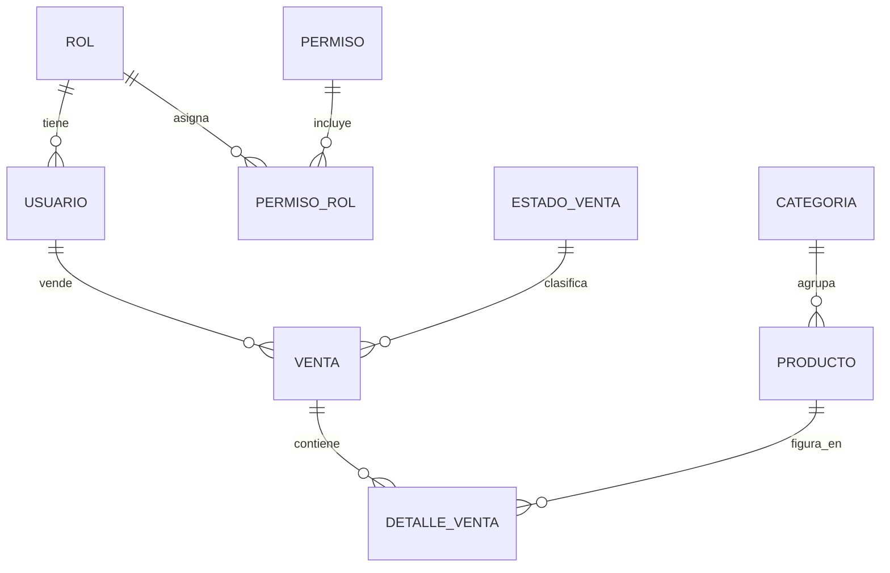

# 🗄️ Portafolio Backend — API REST (.NET 10 + PostgreSQL)

API REST de un **sistema de gestión de ventas** (un sistema transaccional / TPS) construida con **.NET 10** y **PostgreSQL**, con autenticación **JWT**, auditoría de cambios, soft-delete y despliegue en **Docker**.

Este proyecto forma parte de mi portafolio y acompaña al cliente [portafolio-frontend](https://github.com/Alesissss/portafolio-frontend) (React + TypeScript).


---

## ✨ Características

- **Autenticación JWT** con expiración configurable y `ClockSkew = 0`.
- **Modelo de roles y permisos**: usuarios → roles → permisos (tablas `permiso`, `rol`, `permiso_rol`). Hoy los endpoints se protegen con `[Authorize]` (token válido); la autorización **por permiso** con policies está en el roadmap.
- **Auditoría** (`auditoria_log`): registra INSERT/UPDATE/DELETE con estado anterior y nuevo en **JSONB**, más el usuario del JWT y el de la BD.
- **Soft-delete** transversal: todas las tablas de negocio llevan campos de auditoría (`estado_registro`, `usuario_registro`, `fecha_registro`) y una baja lógica de negocio (`estado`).
- **Respuesta uniforme** `ApiResponse<T>` (`{ status, message, data }`) para que el frontend consuma siempre la misma forma.
- **Validación** con **FluentValidation** + un `ValidacionFilter` global; mensajes de error claros y en español.
- **Rate limiting** en el login (5 intentos por minuto) para frenar fuerza bruta.
- **Manejo global de excepciones** (`GlobalExceptionHandler`).
- **CORS** configurable por `appsettings` (`Cors:AllowedOrigins`).
- **Documentación interactiva** con **Scalar** (OpenAPI) en desarrollo.

---

## 🛠️ Stack

| Área | Tecnología |
|---|---|
| Framework | .NET 10 (ASP.NET Core Web API) |
| ORM | Entity Framework Core 10 + Npgsql (snake_case) |
| Base de datos | PostgreSQL |
| Autenticación | JWT (`Microsoft.AspNetCore.Authentication.JwtBearer`) |
| Hashing | BCrypt.Net-Next / `pgcrypto` |
| Validación | FluentValidation |
| Documentación | OpenAPI + Scalar |
| Pruebas | xUnit |
| Contenedores | Docker (imagen `aspnet:10.0`) |

---

## 🗂️ Estructura del proyecto

```
Api/
├── Common/           # ApiResponse<T>, RegistroBase (campos de auditoría)
├── Configurations/   # JwtOptions, ValidacionFilter
├── Controllers/      # AuthController, CategoriaController
├── Data/             # PortafolioDbContext (EF Core)
├── Dtos/             # DTOs de request/response (records)
├── Middlewares/      # CorsConfig, GlobalExceptionHandler
├── Models/           # Entidades (Usuario, Categoria, Producto, Venta, ...)
├── Services/         # Lógica de negocio + Interfaces
├── Validators/       # Reglas FluentValidation
├── SQL/              # 01_DDL.sql (esquema), 02_DML.sql (datos semilla)
└── Program.cs        # Composición de la app (DI, auth, middlewares)
Tests/                # Pruebas unitarias (xUnit)
```

---

## 🧩 Modelo de datos



Cada tabla de negocio incluye además campos de auditoría y una tabla central `auditoria_log` para el histórico de cambios. El esquema completo está en [`Api/SQL/01_DDL.sql`](Api/SQL/01_DDL.sql).

---

## 🚀 Puesta en marcha

### Requisitos

- [.NET 10 SDK](https://dotnet.microsoft.com/)
- PostgreSQL (con la extensión `pgcrypto`, que crea el propio script)
- Docker *(opcional)*

### 1. Crear la base de datos

Ejecuta los scripts en orden sobre tu instancia de PostgreSQL:

```bash
psql -U tu_usuario -d tu_base -f Api/SQL/01_DDL.sql   # tablas e índices
psql -U tu_usuario -d tu_base -f Api/SQL/02_DML.sql   # roles y usuario semilla
```

> El `02_DML.sql` crea los roles (`Superadmin`, `Administrador`, `Vendedor`) y un usuario semilla `atorres`. Las credenciales de ese usuario están en el propio script.

### 2. Configurar secretos

Los valores sensibles **no** se versionan. Usa `dotnet user-secrets` (recomendado) o un `appsettings.Development.json`:

```bash
cd Api
dotnet user-secrets set "ConnectionStrings:DefaultConnection" "Host=localhost;Port=5432;Database=tu_base;Username=tu_usuario;Password=tu_clave"
dotnet user-secrets set "Jwt:Key" "UNA_CLAVE_LARGA_Y_SEGURA_DE_AL_MENOS_32_CARACTERES"
```

Otros parámetros configurables (`appsettings.json`): `Jwt:Issuer`, `Jwt:Audience`, `Jwt:ExpireMinutes` y `Cors:AllowedOrigins`.

### 3. Ejecutar

```bash
cd Api
dotnet run
```

- Estado del API: `GET /`
- Documentación interactiva (solo en desarrollo): **`/scalar/v1`**
- Especificación OpenAPI: `/openapi/v1.json`

### Con Docker

```bash
docker build -t portafolio-backend -f Api/Dockerfile .
docker run -p 8080:8080 portafolio-backend
```

---

## 🧪 Pruebas

```bash
dotnet test
```

---

## 🌿 Flujo de trabajo (Git)

```
main        ← releases estables
 └─ develop ← integración
     └─ alexis ← rama de trabajo personal
```

Las funcionalidades y correcciones se trabajan en ramas `feature/*` y `fix/*`, y se integran a `develop` mediante Pull Request.

---

## 🗺️ Roadmap

- [x] Autenticación (login JWT)
- [x] Módulo de **Categorías** (CRUD completo)
- [x] Módulo de **Productos** (CRUD + relación con categorías + foto)
- [x] Módulo de **Usuarios** (CRUD, alta por administrador)
- [x] Módulo de **Ventas** y detalle de venta (flujo BO → GEN → PAG / AN)
- [ ] **RBAC**: autorización por permiso con policies de ASP.NET Core
- [ ] Módulo de **Reportes**
- [ ] Consumo de la auditoría desde la API
